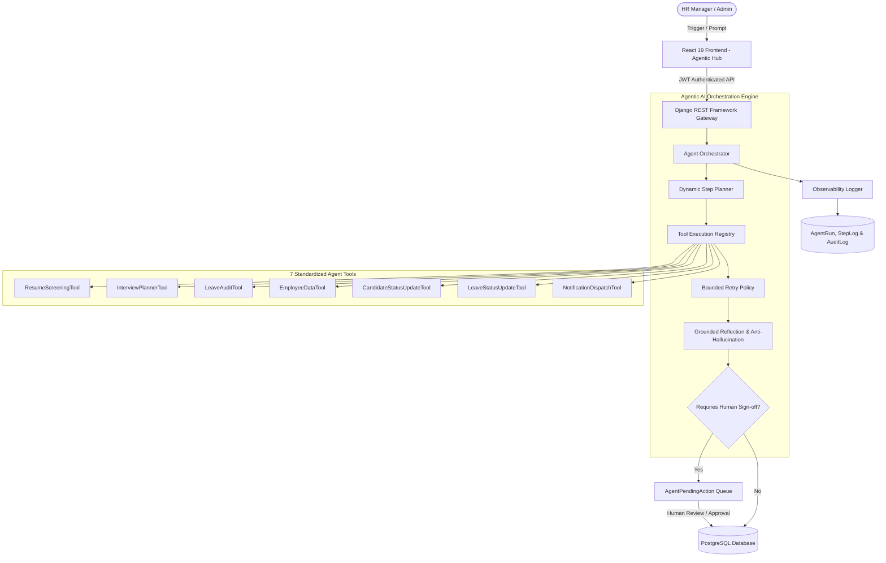

# <p align="center">🤖 AI-HRMS: Intelligent Human Resource Management System with Agentic AI</p>

<p align="center">
  <em>An enterprise-grade, role-based HRMS platform combining core workforce management with an autonomous Agentic AI orchestration layer.</em>
</p>

<p align="center">
  
  
  
  
  
  
  
  
</p>

---

## 🌟 Executive Summary

**AI-HRMS** unifies standard daily human resource operations—employee records, attendance tracking, leave requests, payroll processing with PDF generation, and performance reviews—with a state-of-the-art **Agentic AI Architecture**.

Unlike conventional platforms where AI is merely a collection of isolated prompts, AI-HRMS introduces a **dynamic multi-step orchestration engine**:
- 🧠 **Dynamic Planning**: Decomposes high-level instructions into multi-step execution graphs.
- 🧰 **Standardized Tool Registry**: 7 modular agent tools with strict parameter schemas.
- 🔍 **Grounded Reflection & Anti-Hallucination**: Self-corrects AI outputs, verifies resume skills, and clamps score boundaries.
- 🔄 **Bounded Retry Resilience**: Exponential backoff with jitter to recover from transient AI provider glitches.
- 👤 **Human-in-the-Loop (HITL) Safeguards**: High-impact actions are staged for manager review before applying to the database.
- 📊 **Full Observability**: Live tracing by `trace_id`, per-step latency (ms), token accounting, and cost tracking.

---

## 🏛️ System Architecture



---

## 🤖 The Autonomous Agent Workforce

The system deploys **3 High-Level Autonomous Workflow Agents** supported by **7 Specialized Functional Tool Agents**:

### 🎯 1. Workflow Sub-Agents

| Agent | Trigger Mode | Role & Capabilities |
| :--- | :--- | :--- |
| **Autonomous Recruitment Pipeline Agent** | `RECRUITMENT_PIPELINE` | • Scans candidate resumes against active job openings.<br>• Extracts skills and computes match percentage.<br>• Eliminates hallucinations via reflection.<br>• Conditionally generates customized voice interview questions based on skill gaps.<br>• Stages candidate shortlisting in the Human-in-the-Loop approval queue. |
| **Autonomous Leave & Attendance Auditor Agent** | `LEAVE_AUDIT` | • Scans all pending leave requests across the organization.<br>• Analyzes 30-day attendance history & punctuality ratios.<br>• Detects departmental concurrency bottlenecks.<br>• Produces justified, policy-compliant approval/rejection recommendations. |
| **Natural Language HR Copilot** | `CUSTOM_INSTRUCTION` | • Accepts arbitrary natural language commands (*"Audit all pending leaves this week and flag low-attendance staff"*).<br>• Uses LLM planning to dynamically break down instructions into an executable tool graph.<br>• Runs steps with bounded retry and full telemetry. |

---

### 🛠️ 2. Functional Tool Agents

All tools inherit from `BaseAgentTool` in [backend/agentic/tools/registry.py](file:///c:/Users/manik/Documents/New_HRMS/backend/agentic/tools/registry.py):

- 📄 **`ResumeScreeningTool`**: Text extraction, NLP skill parsing, and role fit scoring.
- 🎙️ **`InterviewPlannerTool`**: Synthesizes skill gaps into role-tailored voice interview questions.
- 📅 **`LeaveAuditTool`**: Cross-verifies attendance records, team capacity, and policy thresholds.
- 🔎 **`EmployeeDataTool`**: Vector-based semantic search & database query retriever.
- 👥 **`CandidateStatusUpdateTool`**: Updates recruitment pipeline status (HITL-gated).
- ✍️ **`LeaveStatusUpdateTool`**: Applies official leave approval/rejection (HITL-gated).
- 🔔 **`NotificationDispatchTool`**: Dispatches system notifications to employees and managers.

---

### 🛡️ 3. Dedicated Inspection Agent
- 🔬 **`StepReflector`** ([reflection.py](file:///c:/Users/manik/Documents/New_HRMS/backend/agentic/engine/reflection.py)):
  Acts as an **autonomous quality inspector** after every step. It cross-examines outputs against source data to eliminate hallucinations, clamps scores to `[0, 100]`, verifies labor policy compliance (e.g. ensuring interview questions never ask about protected personal attributes or salary history), and assigns an inspectable reflection quality score.

---

## 🆚 Old HRMS vs. New HRMS with Agentic AI

| Feature | Old HRMS (Baseline) | New HRMS with Agentic AI |
| :--- | :--- | :--- |
| **Execution Pattern** | Isolated, static function calls | Dynamic multi-step agent graphs with conditional branching |
| **Workflow Planning** | ❌ None (Fixed endpoints) | ✅ Dynamic planner decomposing high-level goals into step graphs |
| **Tool Interface** | ❌ None (Ad-hoc calls) | ✅ Standardized `BaseAgentTool` contract & parameter schemas |
| **Hallucination Control** | ❌ Raw output accepted as-is | ✅ Grounded reflection verifying facts & clamping score bounds |
| **Fault Tolerance** | ❌ Immediate fallback / failure | ✅ Bounded exponential backoff with jitter (`max_retries=3`) |
| **Human Safeguards** | ❌ Manual CRUD only | ✅ First-class Human-in-the-Loop staging queue with audit logs |
| **Telemetry & Observability** | ❌ Zero logging or metrics | ✅ `trace_id`, latency (ms), token usage, and USD cost tracking |
| **User Interface** | Manual single-task pages | Interactive **Agentic AI Automation Hub** (`/agentic`) |

---

## 💻 Tech Stack Overview

```
Frontend:           React 19 • TypeScript • Vite • Tailwind CSS • Recharts • Lucide Icons
Backend:            Django 5.1 • Django REST Framework • SimpleJWT • Python 3.11+
Database & RAG:     PostgreSQL • ChromaDB Vector Database
AI / Providers:     OpenAI / Azure OpenAI (GPT-4o/mini) • Local Ollama • Whisper
Document Engine:    ReportLab (PDF Payslips) • PyPDF
```

---

## 🚀 Quick Start Guide

### 1. Clone the Repository
```powershell
git clone https://github.com/manikya456/HRMS_project_by_Manikya.git
cd HRMS_project_by_Manikya
```

### 2. Backend Setup
```powershell
cd backend

# Create & activate virtual environment
python -m venv venv
venv\Scripts\activate

# Install dependencies
pip install -r requirements.txt

# Configure environment
Copy-Item .env.example .env

# Apply database migrations
python manage.py migrate

# Run agentic verification tests
python manage.py test agentic

# Start Django backend server
python manage.py runserver 0.0.0.0:8000
```
*Backend API available at: `http://127.0.0.1:8000/api`*

---

### 3. Frontend Setup
```powershell
cd frontend

# Install dependencies
npm install

# Start Vite development server
npm run dev
```
*Frontend application available at: `http://127.0.0.1:5173`*

---

## 📡 Agentic REST API Reference

| Method | Endpoint | Description | Auth Required |
| :---: | :--- | :--- | :---: |
| `POST` | `/api/agentic/runs/` | Launch an autonomous workflow or copilot instruction | Yes (Admin/HR) |
| `GET` | `/api/agentic/runs/` | List past agent execution runs | Yes (Admin/HR) |
| `GET` | `/api/agentic/runs/<trace_id>/` | Fetch full execution trace with step logs & critiques | Yes (Admin/HR) |
| `GET` | `/api/agentic/pending-actions/` | List actions staged in the Human-in-the-Loop queue | Yes (Admin/HR) |
| `POST` | `/api/agentic/pending-actions/<id>/decision/` | Approve or reject a staged action | Yes (Admin/HR) |
| `GET` | `/api/agentic/metrics/` | Telemetry: tokens, latency, cost, reflection scores | Yes (Admin/HR) |
| `GET` | `/api/agentic/audit-logs/` | Query immutable system audit logs | Yes (Admin/HR) |
| `GET` | `/api/agentic/tools/` | List registered tools and parameter schemas | Yes (Admin/HR) |

---

## 👥 Role-Based Access Control (RBAC)

- 👑 **`ADMIN`**: Complete administrative authority across data, agent triggers, and configurations.
- 👔 **`SENIOR_MANAGER`**: Access to team operations, agentic automations, approvals, and analytics.
- 🎯 **`HR_RECRUITER`**: Access to candidate screening, AI interviews, and autonomous recruitment agents.
- 👤 **`EMPLOYEE`**: Self-service access for personal attendance, leave requests, payslips, and HR chatbot.
- 🎓 **`CANDIDATE`**: Candidate portal for resume uploads and AI-assisted voice interviews.

---

## 🔒 Privacy, Security & Responsible AI

1. **Anti-Bias Enforcement**: The interview question planner strictly forbids inquiring into protected personal attributes, family planning, or salary histories.
2. **Deterministic Fallbacks**: If external AI models time out, deterministic rule-based algorithms ensure the application remains fully functional.
3. **Data Integrity**: Passwords, keys, and tokens are encrypted and managed exclusively via `.env`.
4. **Auditability**: Every AI recommendation and human approval is immutably logged in `AuditLog`.

---

<p align="center">
  Built with ❤️ for Modern Intelligent HR Management.
</p>
